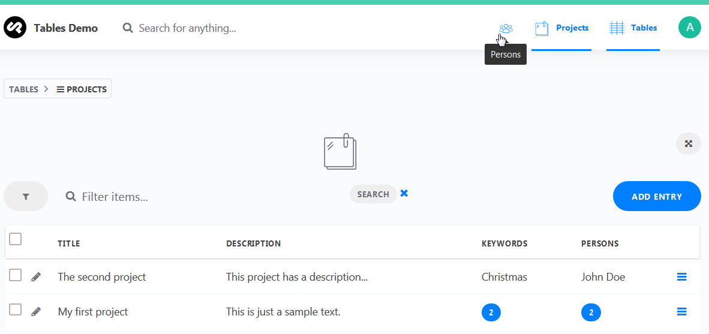
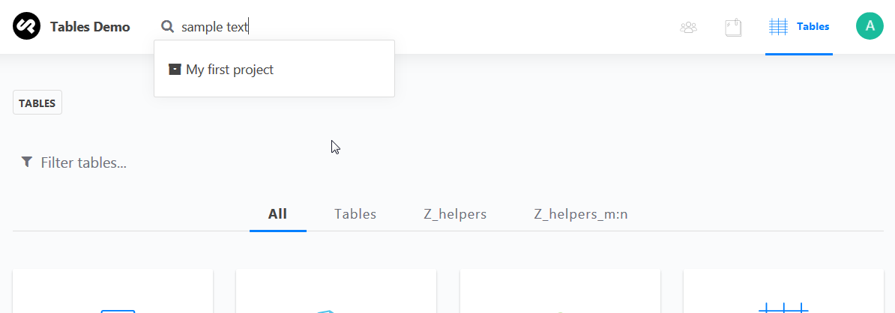

# Event System

Cockpit has a powerful event system and the Tables addon provides multiple events to modify it's behaviour. Modifications can be done in a custom addon (e. g.: `/addons/MyTablesModifier/bootstrap.php`) or in `/config/bootstrap.php`.

## List of events in Tables addon

### Tables

#### find

```php
$app->on('tables.find.before', function($name, &$options) {});
$app->on("tables.find.before.{$name}", function($name, &$options) {});
$app->on('tables.find.after', function($name, &$entries) {});
$app->on("tables.find.after.{$name}", function($name, &$entries) {});
```

#### save

```php
$app->on('tables.save.before', function($name, &$entry, $isUpdate) {});
$app->on("tables.save.before.{$name}", function($name, &$entry, $isUpdate) {});
$app->on('tables.save.after', function($name, &$entry, $isUpdate) {});
$app->on("tables.save.after.{$name}", function($name, &$entry, $isUpdate) {});
```

#### remove

```php
$app->on('tables.remove.before', function($name, &$criteria) {});
$app->on("tables.remove.before.{$name}", function($name, &$criteria) {});
$app->on('tables.remove.after', function($name, $result) {});
$app->on("tables.remove.after.{$name}", function($name, $result) {});
```

M:n helper entries are removed before the actual entry will be removed. So if the remove function starts the tasks to remove referenced entries first, the following events are called before the events above.

```php
$app->on('tables.removereference.before', function(&$table, &$data) {});
$app->on("tables.remove.removereference.{$table}", function($table, &$data) {});
$app->on('tables.removereference.after', function($table, $result) {});
$app->on("tables.removereference.after.{$table}", function($table, $result) {});
```

### Table schema

```php
$app->on('tables.createtableschema', function($table) {});
$app->on('tables.updatetableschema', function($table) {});
$app->on("tables.updatetableschema.{$name}", function($table) {});
$app->on('tables.removetableschema', function($name) {});
$app->on("tables.removetableschema.{$name}", function($name) {});
```

### Dashboard widget

```php
$app->on('tables.dashboard.options', function(&$options) {});
```

### Export

```php
$app->on('tables.export.before', function($table, &$type, &$options) {});
```

## Examples

### Export modifier

By default, the spreadheet export uses the field names as column headers and referenced fields are exported as a comma separated list of ids (`1, 2, 5`). If you want to export a comma separated list of values (`val1, val2, val5`), you have to set the option `populate` to `1` for 1:m fields or to `2` for m:n fields.

To use field labels as column headers, you have to set `$options['pretty'] = true;`.

add this to `/config/bootstrap.php`:

```php
<?php

$app->on('tables.export.before', function($table, &$type, &$options) {

    // populate referenced table fields when exporting data
    $options['populate'] = 2;

    // use labels instead of field names as column headers
    if ($type == 'ods' || $type == 'xls' || $type == 'xlsx') {
        $options['pretty'] = true;
    }

});
```

### Direct links to tables in menu

```php
<?php

// execute only in admin ui and not while fetching data via REST API
if (COCKPIT_ADMIN_CP) {

    // execute on event 'admin.init'
    $app->on('admin.init', function() {

        // create two icons in the modules menu, that point
        // directly to your favourite tables
        $favourites = [
            'persons',
            'projects'
        ];

        foreach ($favourites as $name) {

            // get table definitions
            $table = $this->module('tables')->table($name);

            // add an extra menu item, that links to table
            $this('admin')->addMenuItem('modules', [
                'label'  => !empty($table['label'])
                              ? $table['label'] : $table['name'],
                'icon'   => $table['icon']
                              ? 'assets:app/media/icons/' . $table['icon']
                              : 'tables:icon.svg',
                'route'  => '/tables/entries/' . $table['name'],
                'active' => $this['route'] == '/tables/entries/' . $table['name']
            ]);

        }

    });

}
```

Now you can access the persons and the projects tables directly from the app header:



### Indexing of table entries for cockpit's search bar

```php
// listen to app search to filter tables
$app->on('cockpit.search', function($search, $list) {

    // persons
    if ($this->module('tables')->hasaccess('persons', 'entries_view')) {

        $options = [
            'filter' => [
                'name' => $search . '*',
            ],
            'fields' => [
                'id'   => true,
                'name' => true,
            ]
        ];

        foreach ($this->module('tables')->find('persons', $options) as $entry) {

            $list[] = [
                'icon'  => 'child', // uikit icon name
                'title' => $entry['name'],
                'url'   => $this->routeUrl('/tables/entry/persons/'.$entry['id'])
            ];

        }

    }

    // projects
    if ($this->module('tables')->hasaccess('projects', 'entries_view')) {

        $options = [
            'filter' => [
                '$or' => [
                    'title'       => $search . '*',
                    'description' => $search . '*',
                ],
            ],
            'fields' => [
                'id'    => true,
                'title' => true,
            ],
        ];

        foreach ($this->module('tables')->find('projects', $options) as $entry) {

            $list[] = [
                'icon'  => 'archive', // uikit icon name
                'title' => $entry['title'],
                'url'   => $this->routeUrl('/tables/entry/projects/'.$entry['id'])
            ];

        }

    }

});
```

The project description contains the phrase "sample text":


